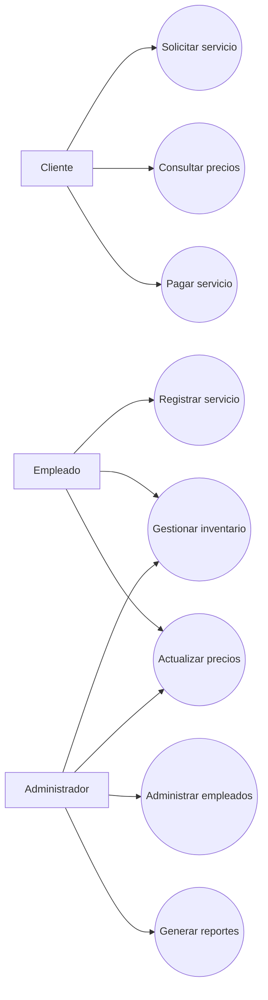
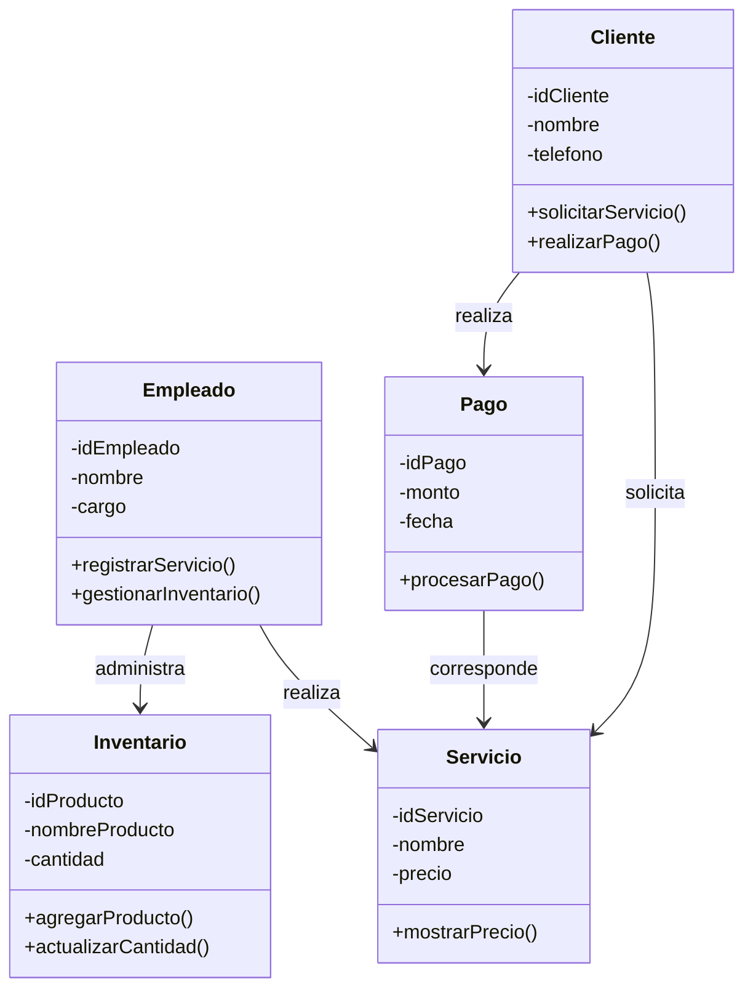
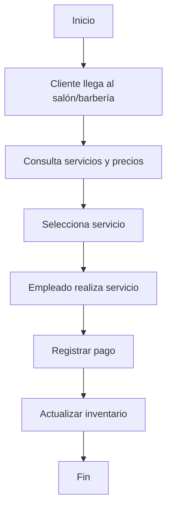
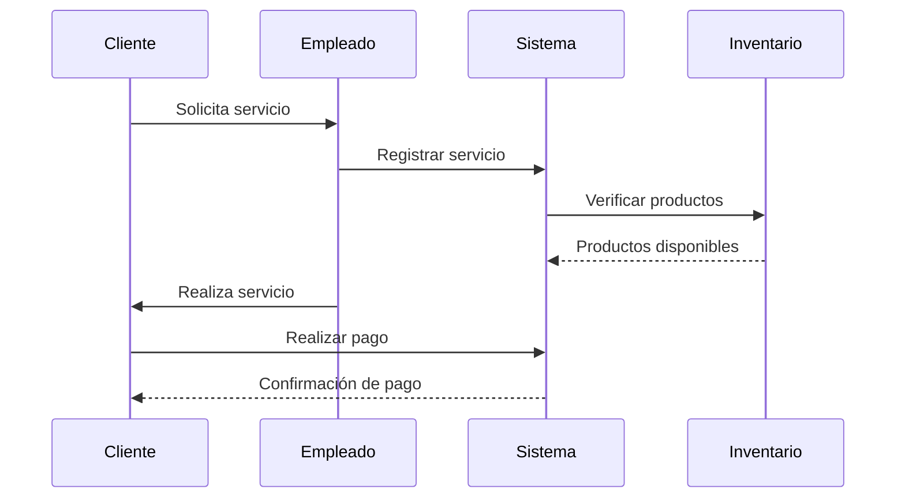
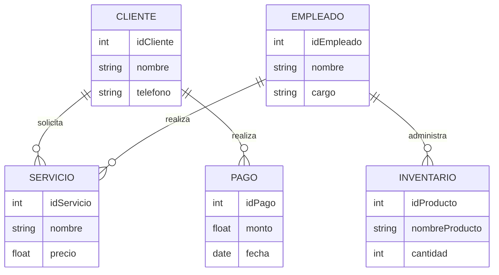

# Diagramas UML – Sistema de Administración de Salones de Belleza y Barberías

## 1. Diagrama de Casos de Uso

---

## 2. Diagrama de Clases

---

## 3. Diagrama de Actividad

---

## 4. Diagrama de Secuencia

---

## 5. Diagrama Entidad-Relación (ER)

---

## 6. Explicación General

Este sistema fue diseñado para ayudar en la administración de un salón de belleza y una barbería, permitiendo organizar de manera más fácil los servicios, los clientes, el inventario y los pagos.

